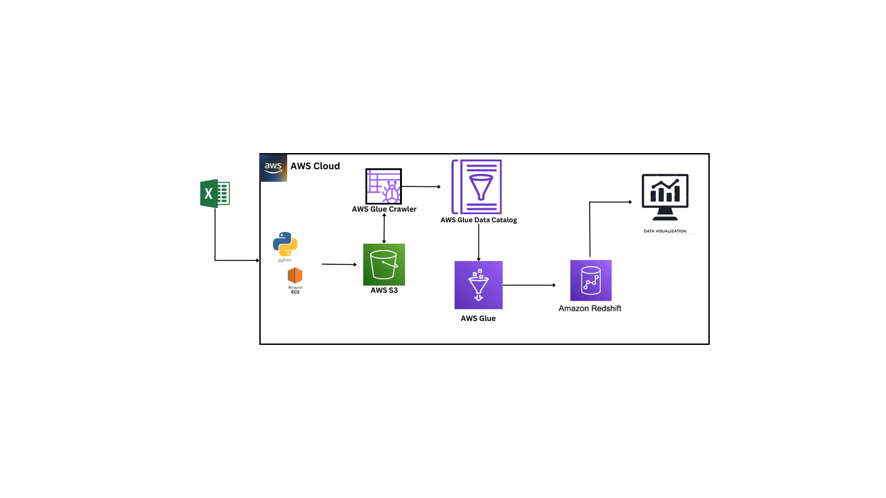

# Introduction

This project aims to help a retail business gain valuable insights from its transaction data. By transforming raw data into meaningful metrics and Key Performance Indicators (KPIs), we provide the foundation for data-driven decision-making. The project utilizes AWS Redshift as the central data warehouse and AWS Glue for data integration.

As the project unfolds, regular updates will be made, and additional information will be furnished.

**Project Objectives**

Our primary goal in this project is to empower the retail business to gain actionable insights from its vast repository of transaction data. To achieve this, we are working to:

1. Transform transaction data into meaningful metrics and Key Performance Indicators (KPIs).
2. Establish AWS Redshift as the central data warehouse, serving as the source of truth for all business data.
3. Implement AWS Glue as the integration platform to seamlessly manage data ingestion and ETL (Extract, Transform, Load) processes.

By achieving these objectives, our aim is to not only enable the business to gain insights into its daily operations but also to establish a scalable and adaptable data infrastructure that will support its growth and evolving analytical needs in the future.

## Project Overview

This project aims to establish a data pipeline for a shopping mall, facilitating the seamless transfer of daily sales records from a spread sheet to a  data warehouse for analytical purposes. The dataset for this endeavor will be simulated using a Python script, mirroring real-world shopping mall sales data as closely as possible.

In this project, we are assisting a retail shopping mall in transitioning from storing their transaction data in spreadsheets to utilizing a data warehouse. This shift enables them to leverage the power of big data and analytics for making data-driven decisions, gaining a deeper understanding of their operations, and facilitating streamlined reporting processes.

## Architecture

## Data Sources and Collection

The data is sourced from the company's point-of-sale systems, capturing transaction details, sales, and customer interactions. However, the data was scripted using Python to generate this data. The script for this `Transactions Generated` [here](HistoricalTransactionGenerator.py) can be found in the project repository.

## Data Transformation and ETL

This section of the project is dedicated to data transformation and ETL (Extract, Transform, Load) processes. These processes are essential for converting raw transaction data into actionable insights that can be used for analytics and decision-making.

In this code snippet, [AWS Glue](code/aws-glue-etl-job.py) is the key tool used to manage the data ingestion and ETL operations. The data flow through the following steps:

1. **Creating a DynamicFrame from Catalog**: The code starts by creating a DynamicFrame from an S3 bucket (S3bucket_node1) using AWS Glue's capabilities. This DynamicFrame is based on a table in the 'retail-database' catalog.

2. **SQL Query Operations**: Two SQL queries are executed. The first query [SqlQuery1](SQL-statements/Glue-Transform-SQL-Query/SQL-Query1.sql) selects data from 'myDataSource,' while the second query [SQL Query2](SQL-statements/Glue-Transform-SQL-Query/SQL-Query2.sql)operates on the result of the first query and 'dim_date.' These SQL queries help filter and transform the data to prepare it for loading into the target data store.

3. **Amazon Redshift Data Loading**: The results of the SQL queries are loaded into an Amazon Redshift database. This is done using AWS Glue's `glueContext.write_dynamic_frame.from_options` method. The 'public.dimdate' and 'public.factsales' tables are created if they don't exist, and the data is loaded into them. The code specifies various connection options for the Redshift destination.

It's essential to note that AWS Glue's serverless architecture streamlines data integration, and while the script for the Glue ETL job was generated by the tool, data engineers have the flexibility to script custom Spark ETL code, or in this case SQL queries as seen in [SqlQuery1](SQL-statements/Glue-Transform-SQL-Query/SQL-Query1.sql) and [SQL Query2](SQL-statements/Glue-Transform-SQL-Query/SQL-Query2.sql), and incorporate them into the `visual transform`. Additionally, the system allows for the creation of custom visual transforms, expanding the range of data transformation possibilities.

This part of the project is pivotal for converting raw transaction data into a format that is suitable for further analysis. It ensures that the data is structured, cleaned, and loaded into the appropriate data store, enabling the generation of valuable insights for the retail business.

## Data Analysis and Insights

The project has yielded insights into sales trends, customer behavior, and product performance, aiding in informed decision-making. A dashboard will be provided in due time.

## References

- [AWS Redshift Documentation](https://aws.amazon.com/redshift/)
- [AWS Glue Documentation](https://aws.amazon.com/glue/)
